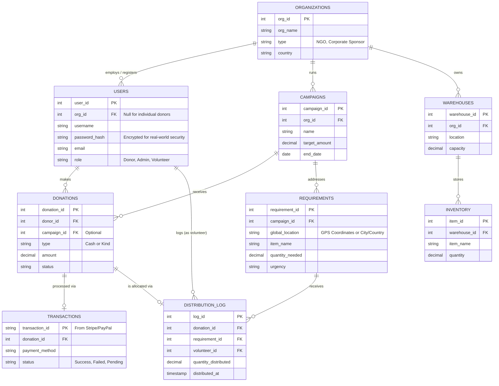

# NGO Relief System - Enterprise Entity Relationship (ER) Diagram

To make this system usable by multiple real-world NGOs globally, we use a "Multi-Tenant" architecture. Here is the expanded blueprint:

### What makes this "Real-World" vs "College Project":
1. **Multi-Tenancy (`ORGANIZATIONS`):** The single biggest difference. A real system isn't just for *one* NGO. It allows hundreds of NGOs (like Red Cross, UNICEF) and Corporate Sponsors (like Google or Microsoft CSR divisions) to sign up, manage their own projects, and collaborate.
2. **Payment Gateways (`TRANSACTIONS`):** Real systems integrate with Stripe or PayPal. We don't just record a donation; we record the exact bank transaction ID for financial auditing.
3. **Logistics (`WAREHOUSES`):** Global NGOs don't have one single inventory pool. They have physical warehouses in different countries.
4. **Targeted Relief (`CAMPAIGNS`):** People rarely donate to a general fund anymore. They donate to specific causes (e.g., "Turkey Earthquake Relief 2026").
5. **Security:** Passwords are hashed, and financial records are tamper-proofed.
